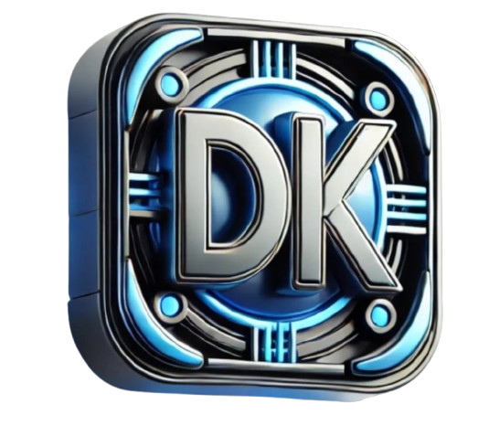

# Deepak Kumar Kashyap — Full Stack Developer Portfolio



A modern, high-performance, and visually stunning portfolio website featuring Glassmorphism, 3D animations, and live data integration.

## 🚀 Key Features

- **Dynamic Hero Section**: Interactive 3D particle background powered by **Three.js**.
- **Live Stats Integration**: Real-time fetching of GitHub and LeetCode statistics.
- **My Journey Timeline**: A professional, animated timeline showcasing educational and professional milestones.
- **Experience & Projects**: High-impact cards with 1/3 image layouts and interactive hover effects.
- **Glassmorphism Design**: Sleek, premium UI with smooth gradients, frosted glass effects, and micro-animations.
- **Modern Contact System**: Functional contact form integrated with **Web3Forms** and custom **Toast Notifications**.
- **Responsive & Optimized**: Fully responsive across all devices with a custom high-performance preloader.
- **Celebration Effects**: Interactive celebration animations to welcome visitors.

## 🛠️ Tech Stack

- **Frontend**: HTML5, Vanilla CSS3 (Custom Design System), JavaScript (ES6+)
- **Animations**: [Anime.js](https://animejs.com/), [Three.js](https://threejs.org/), CSS Keyframes
- **APIs**: GitHub REST API, LeetCode Stats API (via Alfa-LeetCode-API)
- **Deployment**: Integrated with Web3Forms for contact management.

## 📦 Installation & Setup

1. **Clone the repository**:
   ```bash
   git clone https://github.com/Deepak-kumar-kashyap/deepak-kashyap-portfolio.git
   ```
2. **Open the project**:
   Simply open `index.html` in your browser or use a local development server (like VS Code's Live Server).

3. **Configure Profiles**:
   Open `script.js` and update the `CONFIG` object with your GitHub and LeetCode usernames:
   ```javascript
   const CONFIG = {
     githubUsername: 'YOUR_USERNAME',
     leetcodeUsername: 'YOUR_USERNAME',
   };
   ```

## 📄 License

Designed and Built by **Deepak Kumar Kashyap** (© 2026). All Rights Reserved.

---
